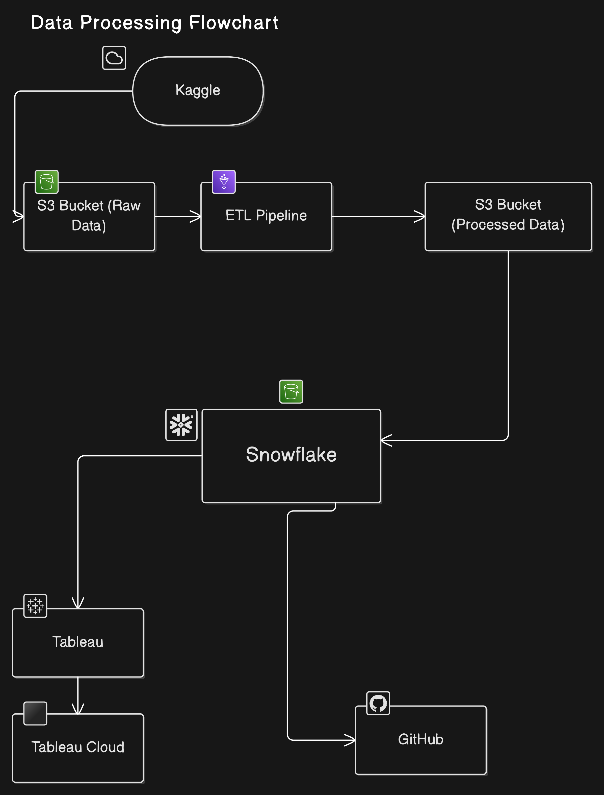

# **Amazon Sales Analysis and Visualization**

## **Project Overview**
This project focuses on **analyzing Amazon sales data** to derive actionable insights that can guide business decisions. The analysis explores sales trends, customer behavior, and product performance. The workflow utilizes **Kaggle** for data sourcing, **AWS S3** for data storage, **Snowflake** for efficient querying and analysis, and **Tableau** for interactive visualizations.

---

## **Tech Stack**
The project leverages the following tools and technologies:

- **Languages**: Python, SQL
- **Data Storage**: AWS S3
- **Data Warehousing**: Snowflake
- **Data Visualization**: Tableau
- **Python Libraries**:
  - `pandas`: For data cleaning and manipulation
  - `boto3`: To interact with AWS S3
  - `os`: For file handling and environment setup
- **Platform**: Kaggle (for dataset sourcing)

---

## **Project Pipeline**



## ***You can see My Dashboard from Tableu Cloud***
```https://prod-apnortheast-a.online.tableau.com/#/site/nikhiliitg07-7db9751398/workbooks/2785561/views?
```


## **Workflow and Tools Used**

### **1. Data Collection and Preparation**
- The dataset was sourced from **Kaggle**.
- Stored the raw data in an **AWS S3 bucket** for accessibility.
- Performed data cleaning and transformation using Python:
  - Removed null values and duplicates.
  - Standardized column names for consistency.
  - Extracted hierarchical categories into subcategories.

### **2. Data Analysis**
- Loaded the cleaned data into **Snowflake** for efficient querying.
- Used **SQL scripts** to:
  - Analyze revenue trends across product categories.
  - Investigate the impact of discounts on sales performance.
  - Examine the relationship between product ratings and sales volume.
  - Identify subcategories contributing to higher profits.

### **3. Data Visualization**
- Connected Snowflake to **Tableau** to create **interactive dashboards**:
  - Visualized revenue distribution by category and subcategory.
  - Highlighted the effect of discounts on sales trends.
  - Mapped customer ratings to sales and reviews.

---

## **Key Insights**
1. **Revenue Distribution**:
   - The "Electronics" category had the highest revenue, driven by "smartphoneandBasicMobile" as a key subcategory.
2. **Impact of Discounts**:
   - Computer and Accessories give the highest discount making it 2nd most selling produucts
3. **Ratings and Sales**:
   cable and accessories got highest rating among all of the items
4. **Profitability**:
   - Subcategories with fewer discounts but high ratings maintained healthier profit margins.

---

## **Steps to Reproduce**

### **1. Prerequisites**
- **AWS Account**: To create an S3 bucket and store data.
- **Snowflake Account**: For querying and analysis.
- **Tableau**: For visualization.
- **Python**: For data preparation.

### **2. Execution Steps**
1. **Clone the Repository**:
   ```bash
   git clone https://github.com/Nikhiliitg/amazon_data_analysis
   cd amazon_data_analysis
   ```

2. **Set Up S3 Bucket**:
   - Create an S3 bucket and upload the Kaggle dataset.

3. **Data Ingestion**:
   - Use the provided Python script to clean and preprocess the data.
   ```bash
   python3 amazon_analysis/src/data_ingestion.py
   ```

4. **Load Data into Snowflake**:
   - Import the cleaned data into Snowflake.
   ```sql
   CREATE OR REPLACE TABLE amazon_sales AS
   SELECT * FROM @S3_Buckets;
   ```

5. **Data Analysis in Snowflake**:
   - Execute SQL queries for exploratory and advanced analysis.

6. **Visualize in Tableau**:
   - Connect Tableau to Snowflake and create dashboards using the prebuilt template.

---

## **Acknowledgments**
- **Kaggle**: For providing the dataset.
- **AWS S3**: For data storage.
- **Snowflake**: For querying and analysis.
- **Tableau**: For visualization.

---

## **Contact**
For questions or feedback, feel free to reach out:

**Email**: nikhiliitg07@gmail.com  
**GitHub**: [https://github.com/Nikhiliitg](https://github.com/Nikhiliitg)
